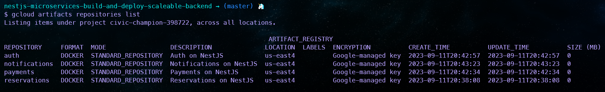
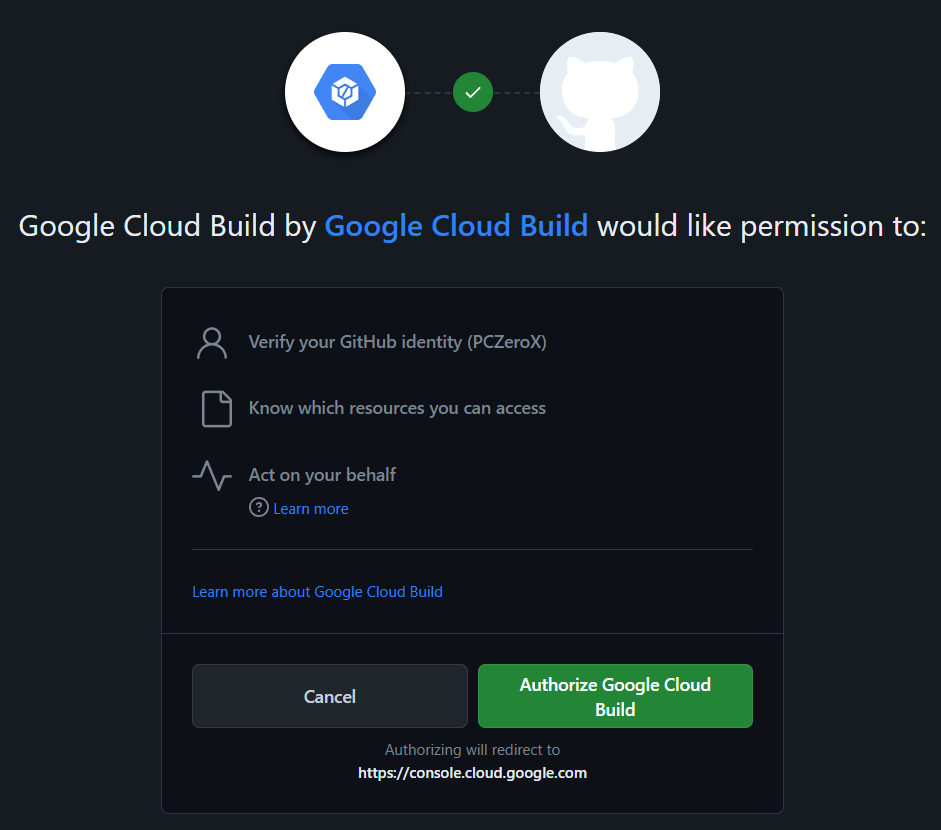

# Nestjs Microservices Build & Deploy a Scaleable Backend

- [Nestjs Microservices Build \& Deploy a Scaleable Backend](#nestjs-microservices-build--deploy-a-scaleable-backend)
  - [Resources](#resources)
  - [1 - Introduction - optional](#1---introduction---optional)
    - [Logger - winston, config and cross env](#logger---winston-config-and-cross-env)
    - [Project setup](#project-setup)
  - [2 - Common Library](#2---common-library)
    - [2.1 - Database and Config Module](#21---database-and-config-module)
    - [2.2 - Abstract Repository](#22---abstract-repository)
    - [2.3 - Reservations CRUD](#23---reservations-crud)
    - [2.4 - Validation \& Logging](#24---validation--logging)
    - [2.5 - Dockerize](#25---dockerize)
  - [3 - Authentication](#3---authentication)
    - [3.1 - Users](#31---users)
    - [3.2 - Passport](#32---passport)
    - [3.3 - Local Strategy](#33---local-strategy)
    - [3.4 - JWT Strategy](#34---jwt-strategy)
    - [3.5 - Common Auth Guard](#35---common-auth-guard)
  - [4 - Payments](#4---payments)
    - [4.1 - Stripe Setup](#41---stripe-setup)
    - [4.2 - Reservations Payments - Part 1](#42---reservations-payments---part-1)
    - [4.3 - Reservations Payments - Part 2](#43---reservations-payments---part-2)
  - [5 - Notifications](#5---notifications)
    - [5.1 - Emit Notification](#51---emit-notification)
    - [5.2 - Email Notification](#52---email-notification)
  - [6 - Production Deployment](#6---production-deployment)
    - [6.1 - Google Cloud Engine Setup](#61---google-cloud-engine-setup)
    - [6.2 - Productionize \& Push Dockerfile](#62---productionize--push-dockerfile)
    - [6.3 - Automated CICD With CloudBuild](#63---automated-cicd-with-cloudbuild)

## Resources

- https://github.com/mguay22/sleepr

```BASH
npm install winston winston-daily-rotate-file @nestjs/config cross-env @nestjs/mongoose mongoose @nestjs/config class-transformer class-validator nestjs-pino pino-http pino-pretty bcryptjs @nestjs/passport passport passport-local bcryptjs cookie-parser @nestjs/jwt passport-jwt @nestjs/microservices stripe nodemailer
```

```BASH
npm install -D @types/bcryptjs @types/cookie-parser @types/passport-local @types/bcryptjs @types/passport-jwt @types/nodemailer
```

Abrir windows terminal como administrador para ejecutar MongoDB en la terminal

```BASH
mongod --dbpath=data/db

mongod --dbpath "C:\Program Files\MongoDB\Server\7.0\data\db"
```

Crear repositor en Github CLI siempre que lo tengas instalado en tu espacio de trabajo

```BASH
gh repo create $(basename "$PWD") --public --source=. --remote=main

gh repo delete nestjs-microservices-build-and-deploy-scaleable-backend
```

## 1 - Introduction - optional

### Logger - winston, config and cross env

```BASH
npm install winston winston-daily-rotate-file @nestjs/config cross-env
```

- https://www.npmjs.com/package/winston
- https://github.com/winstonjs/winston
- https://www.npmjs.com/package/winston-daily-rotate-file
- https://github.com/winstonjs/winston-daily-rotate-file

### Project setup

```BASH
nest generate service ./modules/logger
```

```BASH
nest generate library common
```


```BASH
npm install start:dev
```


`package.json`

```TS
{
  "name": "nestjs-microservices-build-and-deploy-scaleable-backend",
  "private": true,
  "license": "UNLICENSED",
  "scripts": {
    "start:dev": "cross-env NODE_ENV=development nest start --watch",
    "start:debug": "nest start --debug --watch",
    "start:prod": "cross-env NODE_ENV=production node dist/main",
  }
}
```

## 2 - Common Library

### 2.1 - Database and Config Module

```BASH
npm install @nestjs/mongoose mongoose
```

`nest-cli.json`

```JSON
{
  "$schema": "https://json.schemastore.org/nest-cli",
  "collection": "@nestjs/schematics",
  "sourceRoot": "src",
  "compilerOptions": {
    "deleteOutDir": true,
    "webpack": true
  },
  "projects": {
    "common": {
      "type": "library",
      "root": "libs/common",
      "entryFile": "index",
      "sourceRoot": "libs/common/src",
      "compilerOptions": {
        "tsConfigPath": "libs/common/tsconfig.lib.json"
      }
    }
  }
}
```

```BASH
nest generate module database -p common
nest generate module config -p common
```

Abrir windows terminal como administrador

```BASH
mongod --dbpath=data/db

mongod --dbpath "C:\Program Files\MongoDB\Server\7.0\data\db"
```

### 2.2 - Abstract Repository

`./libs/common/src/database/abstract.schema.ts`

```TS
import { Prop, Schema } from '@nestjs/mongoose';
import { SchemaTypes, Types } from 'mongoose';

@Schema()
export class AbstractDocument {
  @Prop({ type: SchemaTypes.ObjectId })
  _id: Types.ObjectId;
}
```

`./libs/common/src/database/abstract.repository.ts`

```TS
import { CreateIndexesOptions } from 'mongodb';
import { Logger, NotFoundException } from '@nestjs/common';
import { FilterQuery, Model, Types, UpdateQuery } from 'mongoose';

import { AbstractDocument } from './abstract.schema';

export abstract class AbstractRepository<TDocument extends AbstractDocument> {
  protected abstract readonly logger: Logger;

  constructor(protected readonly model: Model<TDocument>) {}

  async create(document: Omit<TDocument, '_id'>): Promise<TDocument> {
    const createdDocument = new this.model({
      ...document,
      _id: new Types.ObjectId(),
    });
    return (await createdDocument.save()).toJSON() as unknown as TDocument;
  }

  async findOne(filterQuery: FilterQuery<TDocument>): Promise<TDocument> {
    const document = await this.model.findOne(filterQuery, {}, { lean: true });

    if (!document) {
      this.logger.warn('Document not found with filterQuery', filterQuery);
      throw new NotFoundException('Document not found.');
    }

    return document as TDocument;
  }

  async findOneAndUpdate(
    filterQuery: FilterQuery<TDocument>,
    update: UpdateQuery<TDocument>,
  ) {
    const document = await this.model.findOneAndUpdate(filterQuery, update, {
      lean: true,
      new: true,
    });

    if (!document) {
      this.logger.warn('Document not found with filterQuery', filterQuery);
      throw new NotFoundException('Document not found.');
    }

    return document;
  }

  async find(filterQuery: FilterQuery<TDocument>) {
    return this.model.find(filterQuery, {}, { lean: true });
  }

  async findOneAndDelete(filterQuery: FilterQuery<TDocument>) {
    return this.model.findOneAndDelete(filterQuery, { lean: true });
  }

  async createIndex(options: CreateIndexesOptions) {
    return this.model.createIndexes(options as any);
  }
}
```

### 2.3 - Reservations CRUD

```BASH
npm install class-transformer class-validator
```

```BASH
nest generate app reservations
```


`nest-cli.json`

```JSON
{
  "$schema": "https://json.schemastore.org/nest-cli",
  "collection": "@nestjs/schematics",
  "sourceRoot": "apps/reservations/src",
  "compilerOptions": {
    "deleteOutDir": true,
    "webpack": true,
    "tsConfigPath": "apps/reservations/tsconfig.app.json"
  },
  "projects": {
    "common": {
      "type": "library",
      "root": "libs/common",
      "entryFile": "index",
      "sourceRoot": "libs/common/src",
      "compilerOptions": {
        "tsConfigPath": "libs/common/tsconfig.lib.json"
      }
    },
    "reservations": {
      "type": "application",
      "root": "apps/reservations",
      "entryFile": "main",
      "sourceRoot": "apps/reservations/src",
      "compilerOptions": {
        "tsConfigPath": "apps/reservations/tsconfig.app.json"
      }
    }
  },
  "monorepo": true,
  "root": "apps/reservations"
}
```

`./apps/reservations/src/main.ts`

```TS
import { Logger } from '@nestjs/common';
import { NestFactory } from '@nestjs/core';
import { ConfigService } from '@nestjs/config';

import { ReservationsModule } from './reservations.module';

async function bootstrap() {
  const app = await NestFactory.create(ReservationsModule);
  const logger = new Logger('bootstrap');
  const configService = app.get(ConfigService);
  const PORT = configService.get<number>('PORT');

  await app.listen(PORT);

  logger.log(`🚀 Server started on http://localhost:${PORT}`);
}
bootstrap();
```

`./apps/reservations/src/reservations.module.ts`

```TS
import { Module } from '@nestjs/common';
import { ConfigModule } from '@nestjs/config';

import { ReservationsController } from './reservations.controller';
import { ReservationsService } from './reservations.service';
import { DatabaseModule } from '@app/common';

@Module({
  imports: [
    DatabaseModule,
  ],
  controllers: [ReservationsController],
  providers: [ReservationsService],
})
export class ReservationsModule {}
```

```BASH
nest generate resource reservations
```


`./apps/reservations/src/models/reservation.schema.ts`

```TS
import { Prop, Schema, SchemaFactory } from '@nestjs/mongoose';
import { AbstractDocument } from '@app/common';

@Schema({ versionKey: false })
export class ReservationDocument extends AbstractDocument {
  @Prop()
  timestamp: Date;

  @Prop()
  startDate: Date;

  @Prop()
  endDate: Date;

  @Prop()
  userId: string;

  @Prop()
  invoiceId: string;
}

export const ReservationSchema = SchemaFactory.createForClass(ReservationDocument);
```

POST - http://localhost:4000/reservations

```JSON
{
  "startDate": "12/20/2022",
  "endDate": "12/25/2022",
  "placeId": "12345",
  "invoiceId": "493"
}
{
  "startDate": "12/20/2022",
  "endDate": "12/25/2023",
  "placeId": "56789",
  "invoiceId": "128"
}
```


GET - http://localhost:4000/reservations


GET - http://localhost:4000/reservations/64faa175a32b613a71b88247


PATCH - - http://localhost:4000/reservations/64faa175a32b613a71b88247

```JSON
{
  "startDate": "12/22/2023",
  "endDate": "12/25/2023",
  "placeId": "11111",
  "invoiceId": "256"
}
```


GET - http://localhost:4000/reservations


DELETE - http://localhost:4000/reservations/64faa625a32b613a71b88250


GET - http://localhost:4000/reservations


### 2.4 - Validation & Logging

```BASH
npm install class-transformer class-validator nestjs-pino pino-http pino-pretty
```

```BASH
nest generate module logger
```

`./apps/reservations/src/main.ts`

```TS
import { Logger } from 'nestjs-pino';
import { NestFactory } from '@nestjs/core';
import { ConfigService } from '@nestjs/config';
import { ValidationPipe } from '@nestjs/common';

import { ReservationsModule } from './reservations.module';

async function bootstrap() {
  const app = await NestFactory.create(ReservationsModule);

  app.useGlobalPipes(
    new ValidationPipe({
      whitelist: true,
    }),
  );
  app.useLogger(app.get(Logger));

  const configService = app.get(ConfigService);

  const PORT = configService.get<number>('PORT');

  await app.listen(PORT);

  console.log(`🚀 Server started on http://localhost:${PORT}`);
}
bootstrap();
```

`./apps/reservations/src/reservations.module.ts`

```TS
import { Module } from '@nestjs/common';
import { DatabaseModule } from '@app/common';

import { ReservationsService } from './reservations.service';
import { ReservationsController } from './reservations.controller';
import { ReservationsRepository } from './reservations.repository';
import {
  ReservationDocument,
  ReservationSchema,
} from './models/reservation.schema';


@Module({
  imports: [
    DatabaseModule,
    DatabaseModule.forFeature([
      { name: ReservationDocument.name, schema: ReservationSchema },
    ]),
  ],
  controllers: [ReservationsController],
  providers: [ReservationsService, ReservationsRepository],
})
export class ReservationsModule {}
```

`./libs/common/src/logger/logger.module.ts`

```TS
import { Module } from '@nestjs/common';
import { LoggerModule as PinoLoggerModule } from 'nestjs-pino';

@Module({
  imports: [
    PinoLoggerModule.forRoot({
      pinoHttp: {
        transport: {
          target: 'pino-pretty',
          options: {
            singleLine: true,
          },
        },
      },
    }),
  ],
})
export class LoggerModule {}
```

### 2.5 - Dockerize

`./libs/common/src/config/config.module.ts`

```TS
import { Module } from '@nestjs/common';
import * as Joi from 'joi';
import {
  ConfigService,
  ConfigModule as NestConfigModule,
} from '@nestjs/config';

@Module({
  imports: [
    NestConfigModule.forRoot({
      validationSchema: Joi.object({
        PORT: Joi.number().required(),
        MONGODB_URI: Joi.string().required(),
      }),
    }),
  ],
  providers: [ConfigService],
  exports: [ConfigService],
})
export class ConfigModule {}
```

`package.json`

```JSON
{
  "scripts": {
    "start": "nest start",
    "start:dev": "nest start --watch",
    "start:debug": "nest start --debug --watch"
  },
}
```

`./apps/reservations/Dockerfile`

```TS
FROM node:alpine AS development

WORKDIR /usr/src/app

COPY package.json ./
COPY package-lock.json ./
COPY tsconfig.json ./
COPY nest-cli.json ./

RUN npm install

COPY . .

RUN npm run build

FROM node:alpine AS production

ARG NODE_ENV=production
ENV NODE_ENV=${NODE_ENV}

WORKDIR /usr/src/app

COPY package.json ./
COPY package-lock.json ./

RUN npm install

RUN npm install --prod

COPY --from=development /usr/src/app/dist ./dist

CMD ["node", "dist/apps/reservations/main"]
```

Debes entrar al directorio de reservations para ejecutar el fichero Dockerfile

```BASH
# reservations → (master) 🦄

docker build ../../ -f Dockerfile -t microservices_reservations
```


`docker-compose.yml`

```YML
services:
  reservations:
    build:
      context: .
      dockerfile: ./apps/reservations/Dockerfile
      target: development
    command: npm run start:dev reservations
    env_file:
      - ./apps/reservations/.env
    ports:
      - '4000:4000'
    volumes:
      - .:/usr/src/app
  mongo:
    image: mongo
```

```BASH
docker ps
```


`./apps/reservations/.env`

```BASH
PORT=4000

POSTGRES_DB=pgdata
POSTGRES_USER=pczerox
POSTGRES_PASSWORD=lordmaster0
POSTGRES_PORT=5432
POSTGRES_HOST=localhost

MONGODB_URI=mongodb://mongo/nestjs-microservices-build-and-deploy-scaleable-backend
MONGODB_URI=mongodb://mongo:27017/nestjs-microservices-build-and-deploy-scaleable-backend
```

Nos dirigimos a la raíz del proyecto y donde está también el `docker-compose.yml`

```BASH
docker-compose up
```


## 3 - Authentication

- https://docs.nestjs.com/techniques/cookies
- https://docs.nestjs.com/microservices/basics

### 3.1 - Users

```BASH
npm install bcryptjs cookie-parser
npm install -D @types/bcryptjs @types/cookie-parser
```

```BASH
nest generate app auth
```


```JSON
{
  "$schema": "https://json.schemastore.org/nest-cli",
  "collection": "@nestjs/schematics",
  "sourceRoot": "apps/reservations/src",
  "compilerOptions": {
    "deleteOutDir": true,
    "webpack": true,
    "tsConfigPath": "apps/reservations/tsconfig.app.json"
  },
  "projects": {
    "common": {
      "type": "library",
      "root": "libs/common",
      "entryFile": "index",
      "sourceRoot": "libs/common/src",
      "compilerOptions": {
        "tsConfigPath": "libs/common/tsconfig.lib.json"
      }
    },
    "reservations": {
      "type": "application",
      "root": "apps/reservations",
      "entryFile": "main",
      "sourceRoot": "apps/reservations/src",
      "compilerOptions": {
        "tsConfigPath": "apps/reservations/tsconfig.app.json"
      }
    },
    "auth": {
      "type": "application",
      "root": "apps/auth",
      "entryFile": "main",
      "sourceRoot": "apps/auth/src",
      "compilerOptions": {
        "tsConfigPath": "apps/auth/tsconfig.app.json"
      }
    }
  },
  "monorepo": true,
  "root": "apps/reservations"
}
```

```BASH
nest generate module users
nest generate controller users
nest generate service users
```


Vamos a crear una especie de token con el módulo crypto de nodejs

```BASH
node

Welcome to Node.js v18.17.1.
Type ".help" for more information.

require("crypto").randomBytes(64).toString("hex")

'f72bfd2b07a00114df02e0827f7053bb6490470cd1f37a53d1ab8cb03e9c4f1467e313bb330a220c12249dfcb649516835e209ba14a0848ab9b54f5e6d8a7158'
```

`./apps/auth/.env`

```BASH
HTTP_PORT=5000
TCP_PORT=5001

JWT_SECRET=f72bfd2b07a00114df02e0827f7053bb6490470cd1f37a53d1ab8cb03e9c4f1467e313bb330a220c12249dfcb649516835e209ba14a0848ab9b54f5e6d8a7158
JWT_EXPIRATION=3600

MONGODB_URI=mongodb://mongo/nestjs-microservices-build-and-deploy-scaleable-backend
# MONGODB_URI=mongodb://mongo:27017/nestjs-microservices-build-and-deploy-scaleable-backend
```

`./apps/reservations/.env`

```BASH
PORT=4000

PAYMENTS_HOST=payments
PAYMENTS_PORT=6000

AUTH_HOST=auth
AUTH_PORT=5000

MONGODB_URI=mongodb://mongo/nestjs-microservices-build-and-deploy-scaleable-backend
# MONGODB_URI=mongodb://mongo:27017/nestjs-microservices-build-and-deploy-scaleable-backend
# MONGODB_URI=mongodb://127.0.0.1/nestjs-microservices-build-and-deploy-scaleable-backend
```

`docker-compose.yml`

```YML
services:
  reservations:
    build:
      context: .
      dockerfile: ./apps/reservations/Dockerfile
      target: development
    command: npm run start:dev reservations
    env_file:
      - ./apps/reservations/.env
    ports:
      - '4000:4000'
    volumes:
      - .:/usr/src/app
  auth:
    build:
      context: .
      dockerfile: ./apps/auth/Dockerfile
      target: development
    command: npm run start:dev auth
    env_file:
      - ./apps/auth/.env
    ports:
      - '5000:5000'
    volumes:
      - .:/usr/src/app
  mongo:
    image: mongo
```

POST - http://localhost:5000/users

```JSON
{
  "email": "admin@email.com",
  "password": "@LORDmaster0"
}
```


### 3.2 - Passport

```BASH
npm install @nestjs/passport passport passport-local @nestjs/jwt passport-jwt
npm install -D @types/passport-local @types/passport-jwt
```

`./libs/common/src/database/database.module.ts`

```TS
import { Module } from '@nestjs/common';
import { ConfigService } from '@nestjs/config';
import { ModelDefinition, MongooseModule } from '@nestjs/mongoose';

@Module({
  imports: [
    MongooseModule.forRootAsync({
      useFactory: (configService: ConfigService) => ({
        uri: configService.get('MONGODB_URI'),
      }),
      inject: [ConfigService],
    }),
  ],
})
export class DatabaseModule {
  static forFeature(models: ModelDefinition[]) {
    return MongooseModule.forFeature(models);
  }
}
```

`./apps/auth/src/auth.module.ts`

```TS
import * as Joi from 'joi';
import { Module } from '@nestjs/common';
import { JwtModule } from '@nestjs/jwt';
import { LoggerModule } from '@app/common';
import { ConfigModule, ConfigService } from '@nestjs/config';

import { AuthService } from './auth.service';
import { AuthController } from './auth.controller';

import { UsersModule } from './users/users.module';

@Module({
  imports: [
    UsersModule,
    LoggerModule,
    ConfigModule.forRoot({
      isGlobal: true,
      validationSchema: Joi.object({
        MONGODB_URI: Joi.string().required(),
        JWT_SECRET: Joi.string().required(),
        JWT_EXPIRATION: Joi.string().required(),
        HTTP_PORT: Joi.number().required(),
        TCP_PORT: Joi.number().required(),
      }),
    }),
    JwtModule.registerAsync({
      useFactory: (configService: ConfigService) => ({
        secret: configService.get<string>('JWT_SECRET'),
        signOptions: {
          expiresIn: `${configService.get('JWT_EXPIRATION')}s`,
        },
      }),
      inject: [ConfigService],
    }),
  ],
  controllers: [AuthController],
  providers: [AuthService],
})
export class AuthModule {}
```

`./apps/reservations/src/reservations.module.ts`

```TS
import * as Joi from 'joi';
import { Module } from '@nestjs/common';
import { ConfigModule } from '@nestjs/config';
import { DatabaseModule, LoggerModule } from '@app/common';

import { ReservationsService } from './reservations.service';
import { ReservationsRepository } from './reservations.repository';
import { ReservationsController } from './reservations.controller';
import {
  ReservationDocument,
  ReservationSchema,
} from './models/reservation.schema';

@Module({
  imports: [
    DatabaseModule,
    DatabaseModule.forFeature([
      { name: ReservationDocument.name, schema: ReservationSchema },
    ]),
    LoggerModule,
    ConfigModule.forRoot({
      isGlobal: true,
      validationSchema: Joi.object({
        MONGODB_URI: Joi.string().required(),
        PORT: Joi.number().required(),
        AUTH_HOST: Joi.string().required(),
        PAYMENTS_HOST: Joi.string().required(),
        AUTH_PORT: Joi.number().required(),
        PAYMENTS_PORT: Joi.number().required(),
      }),
    }),
  ],
  controllers: [ReservationsController],
  providers: [ReservationsService, ReservationsRepository],
})
export class ReservationsModule {}
```

### 3.3 - Local Strategy

```BASH
npm install bcryptjs
npm install -D @types/bcryptjs
```

```BASH
nest generate guard guards/local-auth --flat
nest generate guard guards/jwt-auth --flat
```


`./apps/auth/src/strategies/local.strategy.ts`

```TS
import { Strategy } from 'passport-local';
import { PassportStrategy } from '@nestjs/passport';
import { Injectable, UnauthorizedException } from '@nestjs/common';

import { UsersService } from '../users/users.service';

@Injectable()
export class LocalStategy extends PassportStrategy(Strategy) {
  constructor(private readonly usersService: UsersService) {
    super({ usernameField: 'email' });
  }

  async validate(email: string, password: string) {
    try {
      return await this.usersService.verifyUser(email, password);
    } catch (err) {
      throw new UnauthorizedException(err);
    }
  }
}
```

`./apps/auth/src/strategies/jwt.strategy.ts`

```TS
import { Injectable } from '@nestjs/common';
import { ConfigService } from '@nestjs/config';
import { PassportStrategy } from '@nestjs/passport';
import { ExtractJwt, Strategy } from 'passport-jwt';

import { TokenPayload } from '../interfaces/token-payload.interface';

import { UsersService } from '../users/users.service';

@Injectable()
export class JwtStrategy extends PassportStrategy(Strategy) {
  constructor(
    configService: ConfigService,
    private readonly usersService: UsersService,
  ) {
    super({
      jwtFromRequest: ExtractJwt.fromExtractors([
        (request: any) =>
          request?.cookies?.Authentication ||
          request?.Authentication ||
          request?.headers.Authentication,
      ]),
      secretOrKey: configService.get('JWT_SECRET'),
    });
  }

  async validate({ userId }: TokenPayload) {
    return this.usersService.getUser({ _id: userId });
  }
}
```

`./libs/common/src/decorators/current-user.decorator.ts`

```TS
import { createParamDecorator, ExecutionContext } from '@nestjs/common';

import { UserDocument } from '../models/user.schema';

const getCurrentUserByContext = (context: ExecutionContext): UserDocument => {
  return context.switchToHttp().getRequest().user;
};

export const CurrentUser = createParamDecorator(
  (_data: unknown, context: ExecutionContext) =>
    getCurrentUserByContext(context),
);
```

`./apps/auth/src/auth.controller.ts`

```TS
import { Response } from 'express';
import { CurrentUser, UserDocument } from '@app/common';
import { MessagePattern, Payload } from '@nestjs/microservices';
import { Controller, Post, Res, UseGuards } from '@nestjs/common';

import { LocalAuthGuard } from './guards/local-auth.guard';
import { JwtAuthGuard } from './guards/jwt-auth.guard';

import { AuthService } from './auth.service';

@Controller('auth')
export class AuthController {
  constructor(private readonly authService: AuthService) {}

  @UseGuards(LocalAuthGuard)
  @Post('login')
  async login(
    @CurrentUser() user: UserDocument,
    @Res({ passthrough: true }) response: Response,
  ) {
    const jwt = await this.authService.login(user, response);
    response.send(jwt);
  }

  @UseGuards(JwtAuthGuard)
  @MessagePattern('authenticate')
  async authenticate(@Payload() data: any) {
    return data.user;
  }
}
```

Create an user

POST - http://localhost:5000/users

```JSON
{
    "email": "admin@email.com",
    "password": "@LORDmaster0"
}
```

POST - http://localhost:5000/auth/login

```JSON
{
    "email": "admin@email.com",
    "password": "@LORDmaster0"
}
```


### 3.4 - JWT Strategy

```BASH
npm install cookie-parser
npm install -D @types/cookie-parser
```

`./apps/auth/src/interfaces/token-payload.interface.ts`

```TS
export interface TokenPayload {
  userId: string;
}
```

`./apps/auth/src/guards/jwt-auth.guard.ts`

```TS
import { AuthGuard } from '@nestjs/passport';

export class JwtAuthGuard extends AuthGuard('jwt') {}
```

`./apps/auth/src/users/dto/get-user.dto.ts`

```TS
import { IsNotEmpty, IsString } from 'class-validator';

export class GetUserDto {
  @IsString()
  @IsNotEmpty()
  _id: string;
}
```

`./apps/auth/src/strategies/jwt.strategy.ts`

```TS
import { Injectable } from '@nestjs/common';
import { ConfigService } from '@nestjs/config';
import { PassportStrategy } from '@nestjs/passport';
import { ExtractJwt, Strategy } from 'passport-jwt';

import { TokenPayload } from '../interfaces/token-payload.interface';

import { UsersService } from '../users/users.service';

@Injectable()
export class JwtStrategy extends PassportStrategy(Strategy) {
  constructor(
    configService: ConfigService,
    private readonly usersService: UsersService,
  ) {
    super({
      jwtFromRequest: ExtractJwt.fromExtractors([
        (request: any) =>
          request?.cookies?.Authentication ||
          request?.Authentication ||
          request?.headers.Authentication,
      ]),
      secretOrKey: configService.get('JWT_SECRET'),
    });
  }

  async validate({ userId }: TokenPayload) {
    return this.usersService.getUser({ _id: userId });
  }
}
```

`./apps/auth/src/auth.module.ts`

```TS
import * as Joi from 'joi';
import { Module } from '@nestjs/common';
import { JwtModule } from '@nestjs/jwt';
import { LoggerModule } from '@app/common';
import { ConfigModule, ConfigService } from '@nestjs/config';

import { AuthService } from './auth.service';
import { AuthController } from './auth.controller';

import { LocalStategy } from './strategies/local.strategy';
import { JwtStrategy } from './strategies/jwt.strategy';

import { UsersModule } from './users/users.module';

@Module({
  imports: [
    UsersModule,
    LoggerModule,
    ConfigModule.forRoot({
      isGlobal: true,
      validationSchema: Joi.object({
        MONGODB_URI: Joi.string().required(),
        JWT_SECRET: Joi.string().required(),
        JWT_EXPIRATION: Joi.string().required(),
        HTTP_PORT: Joi.number().required(),
        TCP_PORT: Joi.number().required(),
      }),
    }),
    JwtModule.registerAsync({
      useFactory: (configService: ConfigService) => ({
        secret: configService.get<string>('JWT_SECRET'),
        signOptions: {
          expiresIn: `${configService.get('JWT_EXPIRATION')}s`,
        },
      }),
      inject: [ConfigService],
    }),
  ],
  controllers: [AuthController],
  providers: [AuthService, LocalStategy, JwtStrategy],
})
export class AuthModule {}
```

`./apps/auth/src/users/users.controller.ts`

```TS
import { Body, Controller, Get, Post, UseGuards } from '@nestjs/common';
import { CurrentUser, UserDocument } from '@app/common';

import { CreateUserDto } from './dto/create-user.dto';

import { UsersService } from './users.service';
import { JwtAuthGuard } from '../guards/jwt-auth.guard';

@Controller('users')
export class UsersController {
  constructor(private readonly usersService: UsersService) {}

  @Post()
  async createUser(@Body() createUserDto: CreateUserDto) {
    return this.usersService.create(createUserDto);
  }

  @Get()
  @UseGuards(JwtAuthGuard)
  async getUser(@CurrentUser() user: UserDocument) {
    return user;
  }
}
```

`./apps/auth/src/users/users.service.ts`

```TS
import {
  Injectable,
  UnauthorizedException,
  UnprocessableEntityException,
} from '@nestjs/common';
import * as bcrypt from 'bcryptjs';

import { UsersRepository } from './users.repository';

import { CreateUserDto } from './dto/create-user.dto';
import { GetUserDto } from './dto/get-user.dto';

@Injectable()
export class UsersService {
  constructor(private readonly usersRepository: UsersRepository) {}

  async create(createUserDto: CreateUserDto) {
    await this.validateCreateUserDto(createUserDto);

    return this.usersRepository.create({
      ...createUserDto,
      password: await bcrypt.hash(createUserDto.password, 10),
    });
  }

  private async validateCreateUserDto(createUserDto: CreateUserDto) {
    try {
      await this.usersRepository.findOne({ email: createUserDto.email });
    } catch (err) {
      return;
    }
    throw new UnprocessableEntityException('Email already exists.');
  }

  async verifyUser(email: string, password: string) {
    const user = await this.usersRepository.findOne({ email });
    const passwordIsValid = await bcrypt.compare(password, user.password);
    if (!passwordIsValid) {
      throw new UnauthorizedException('Credentials are not valid.');
    }
    return user;
  }

  async getUser(getUserDto: GetUserDto) {
    return this.usersRepository.findOne(getUserDto);
  }
}
```

POST - http://localhost:5000/users

```JSON
{
    "email": "admin@email.com",
    "password": "@LORDmaster0"
}
```


### 3.5 - Common Auth Guard

```BASH
npm install @nestjs/microservices
```

```BASH
nest generate guard auth/jwt-auth --flat
# Which project would you like to generate to? common
```

`./libs/common/src/constants/service.ts`

```TS
export const AUTH_SERVICE = 'auth';
export const PAYMENTS_SERVICE = 'payments';
export const NOTIFICATIONS_SERVICE = 'notifications';
```

`./libs/common/src/auth/jwt-auth.guard.ts`

```TS
import {
  CanActivate,
  ExecutionContext,
  Inject,
  Injectable,
  Logger,
  UnauthorizedException,
} from '@nestjs/common';
import { Reflector } from '@nestjs/core';
import { ClientProxy } from '@nestjs/microservices';
import { Observable, catchError, map, of, tap } from 'rxjs';

import { UserDto } from '../dto';

import { AUTH_SERVICE } from '../constants';

@Injectable()
export class JwtAuthGuard implements CanActivate {
  private readonly logger = new Logger(JwtAuthGuard.name);

  constructor(
    @Inject(AUTH_SERVICE) private readonly authClient: ClientProxy,
    private readonly reflector: Reflector,
  ) {}

  canActivate(
    context: ExecutionContext,
  ): boolean | Promise<boolean> | Observable<boolean> {
    const jwt =
      context.switchToHttp().getRequest().cookies?.Authentication ||
      context.switchToHttp().getRequest().headers?.authentication;

    if (!jwt) {
      return false;
    }

    const roles = this.reflector.get<string[]>('roles', context.getHandler());

    return this.authClient
      .send<UserDto>('authenticate', {
        Authentication: jwt,
      })
      .pipe(
        tap((res) => {
          if (roles) {
            for (const role of roles) {
              if (!res.roles?.includes(role)) {
                this.logger.error('The user does not have valid roles.');
                throw new UnauthorizedException();
              }
            }
          }
          context.switchToHttp().getRequest().user = res;
        }),
        map(() => true),
        catchError((err) => {
          this.logger.error(err);
          return of(false);
        }),
      );
  }
}
```

`./apps/auth/src/main.ts`

```TS
import { Logger } from 'nestjs-pino';
import { NestFactory } from '@nestjs/core';
import * as cookieParser from 'cookie-parser';
import { ConfigService } from '@nestjs/config';
import { ValidationPipe } from '@nestjs/common';
import { Transport } from '@nestjs/microservices';

import { AuthModule } from './auth.module';

async function bootstrap() {
  const app = await NestFactory.create(AuthModule);
  const configService = app.get(ConfigService);

  const TCP_PORT = configService.get<number>('TCP_PORT');
  const HTTP_PORT = configService.get<number>('HTTP_PORT');

  app.use(cookieParser());
  app.connectMicroservice({
    transport: Transport.TCP,
    options: {
      host: '0.0.0.0',
      port: TCP_PORT,
    },
  });
  app.useGlobalPipes(
    new ValidationPipe({
      whitelist: true,
    }),
  );
  app.useLogger(app.get(Logger));

  await app.listen(HTTP_PORT);

  console.log(`🚀 Server started on http://localhost:${HTTP_PORT}`);
}
bootstrap();
```

`./apps/auth/src/strategies/jwt.strategy.ts`

```TS
import { Injectable } from '@nestjs/common';
import { ConfigService } from '@nestjs/config';
import { PassportStrategy } from '@nestjs/passport';
import { ExtractJwt, Strategy } from 'passport-jwt';

import { TokenPayload } from '../interfaces/token-payload.interface';

import { UsersService } from '../users/users.service';

@Injectable()
export class JwtStrategy extends PassportStrategy(Strategy) {
  constructor(
    configService: ConfigService,
    private readonly usersService: UsersService,
  ) {
    super({
      jwtFromRequest: ExtractJwt.fromExtractors([
        (request: any) =>
          request?.cookies?.Authentication ||
          request?.Authentication ||
          request?.headers.Authentication,
      ]),
      secretOrKey: configService.get('JWT_SECRET'),
    });
  }

  async validate({ userId }: TokenPayload) {
    return this.usersService.getUser({ _id: userId });
  }
}
```

`./apps/reservations/src/main.ts`

```TS
import { Logger } from 'nestjs-pino';
import { NestFactory } from '@nestjs/core';
import * as cookieParser from 'cookie-parser';
import { ConfigService } from '@nestjs/config';
import { ValidationPipe } from '@nestjs/common';

import { ReservationsModule } from './reservations.module';

async function bootstrap() {
  const app = await NestFactory.create(ReservationsModule);

  app.useGlobalPipes(
    new ValidationPipe({
      whitelist: true,
    }),
  );
  app.useLogger(app.get(Logger));
  app.use(cookieParser());

  const configService = app.get(ConfigService);

  const PORT = configService.get<number>('PORT');

  await app.listen(PORT);

  console.log(`🚀 Server started on http://localhost:${PORT}`);
}
bootstrap();
```

`./apps/reservations/src/reservations.module.ts`

```TS
import * as Joi from 'joi';
import { Module } from '@nestjs/common';
import { ConfigModule, ConfigService } from '@nestjs/config';
import { DatabaseModule, LoggerModule, PAYMENTS_SERVICE } from '@app/common';

import { ReservationsService } from './reservations.service';
import { ReservationsRepository } from './reservations.repository';
import { ReservationsController } from './reservations.controller';
import {
  ReservationDocument,
  ReservationSchema,
} from './models/reservation.schema';
import { ClientsModule, Transport } from '@nestjs/microservices';
import { AUTH_SERVICE } from '@app/common';

@Module({
  imports: [
    DatabaseModule,
    DatabaseModule.forFeature([
      { name: ReservationDocument.name, schema: ReservationSchema },
    ]),
    LoggerModule,
    ConfigModule.forRoot({
      isGlobal: true,
      validationSchema: Joi.object({
        MONGODB_URI: Joi.string().required(),
        PORT: Joi.number().required(),
        AUTH_HOST: Joi.string().required(),
        PAYMENTS_HOST: Joi.string().required(),
        AUTH_PORT: Joi.number().required(),
        PAYMENTS_PORT: Joi.number().required(),
      }),
    }),
    ClientsModule.registerAsync([
      {
        name: AUTH_SERVICE,
        useFactory: (configService: ConfigService) => ({
          transport: Transport.TCP,
          options: {
            host: configService.get('AUTH_HOST'),
            port: configService.get('AUTH_PORT'),
          },
        }),
        inject: [ConfigService],
      },
      {
        name: PAYMENTS_SERVICE,
        useFactory: (configService: ConfigService) => ({
          transport: Transport.TCP,
          options: {
            host: configService.get('PAYMENTS_HOST'),
            port: configService.get('PAYMENTS_PORT'),
          },
        }),
        inject: [ConfigService],
      },
    ]),
  ],
  controllers: [ReservationsController],
  providers: [ReservationsService, ReservationsRepository],
})
export class ReservationsModule {}
```

`./apps/auth/src/auth.controller.ts`

```TS
import { Response } from 'express';
import { CurrentUser, UserDocument } from '@app/common';
import { MessagePattern, Payload } from '@nestjs/microservices';
import { Controller, Post, Res, UseGuards } from '@nestjs/common';

import { LocalAuthGuard } from './guards/local-auth.guard';
import { JwtAuthGuard } from './guards/jwt-auth.guard';

import { AuthService } from './auth.service';

@Controller('auth')
export class AuthController {
  constructor(private readonly authService: AuthService) {}

  @UseGuards(LocalAuthGuard)
  @Post('login')
  async login(
    @CurrentUser() user: UserDocument,
    @Res({ passthrough: true }) response: Response,
  ) {
    const jwt = await this.authService.login(user, response);
    response.send(jwt);
  }

  @UseGuards(JwtAuthGuard)
  @MessagePattern('authenticate')
  async authenticate(@Payload() data: any) {
    return data.user;
  }
}
```

POST - http://localhost:5000/users

```JSON
{
  "email": "admin@email.com",
  "password": "@LORDmaster0"
}
```


POST - http://localhost:5000/auth/login

```JSON
{
  "email": "admin@email.com",
  "password": "@LORDmaster0"
}
```


POST - http://localhost:4000/reservations

```JSON
{
  "startDate": "12-20-2023",
  "endDate": "12-25-2023",
  "placeId": "333",
  "invoiceId": "333"
}
```


`./apps/reservations/src/reservations.controller.ts`

```TS
@Controller('reservations')
export class ReservationsController {
  constructor(private readonly reservationsService: ReservationsService) {}

  @Post()
  @UseGuards(JwtAuthGuard)
  async create(
    @Body() createReservationDto: CreateReservationDto,
    @CurrentUser() user: UserDto,
  ) {
    const _user = await this.reservationsService.create(
      createReservationDto,
      user._id,
    );

    console.log(user);

    return _user;
  }
}
```


## 4 - Payments

```BASH
npm install stripe
```

```BASH
nest generate app payments
```


- https://stripe.com/
- https://stripe.com/docs/api
- https://dashboard.stripe.com/
- https://stripe.com/docs/api/versioning


### 4.1 - Stripe Setup

`docker-compose.yml`

```YML
services:
  reservations:
    build:
      context: .
      dockerfile: ./apps/reservations/Dockerfile
      target: development
    command: npm run start:dev reservations
    env_file:
      - ./apps/reservations/.env
    ports:
      - '4000:4000'
    volumes:
      - .:/usr/src/app
  auth:
    build:
      context: .
      dockerfile: ./apps/auth/Dockerfile
      target: development
    command: npm run start:dev auth
    env_file:
      - ./apps/auth/.env
    ports:
      - '5000:5000'
    volumes:
      - .:/usr/src/app
  payments:
    build:
      context: .
      dockerfile: ./apps/payments/Dockerfile
      target: development
    command: npm run start:dev payments
    env_file:
      - ./apps/payments/.env
    volumes:
      - .:/usr/src/app
  mongo:
    image: mongo
```

`./apps/payments/Dockerfile`

```TS
FROM node:alpine AS development

WORKDIR /usr/src/app

COPY package.json ./
COPY package-lock.json ./
COPY tsconfig.json ./
COPY nest-cli.json ./

RUN npm install

COPY . .

RUN npm run build

FROM node:alpine AS production

ARG NODE_ENV=production
ENV NODE_ENV=${NODE_ENV}

WORKDIR /usr/src/app

COPY package.json ./
COPY package-lock.json ./

RUN npm install

RUN npm install --prod

COPY --from=development /usr/src/app/dist ./dist

CMD ["node", "dist/apps/payments/main"]
```

`./apps/payments/.env`

https://dashboard.stripe.com/test/apikeys

```BASH
PORT=6000

NOTIFICATIONS_HOST=notifications
NOTIFICATIONS_PORT=7001

STRIPE_SECRET_KEY=sk_test_51NofyUA8JOq4rZnrxbi6YvPvyVWkq8KxBOYL9chIJxHzVY516bcBwrCI9jZwcclfyvX5qOAudcCckh3Z0geI3x2200kWujTqdV
```

`./apps/payments/src/payments.module.ts`

```TS
import * as Joi from 'joi';
import { Module } from '@nestjs/common';
import { ConfigModule, ConfigService } from '@nestjs/config';
import { ClientsModule, Transport } from '@nestjs/microservices';

import { LoggerModule, NOTIFICATIONS_SERVICE } from '@app/common';

import { PaymentsService } from './payments.service';
import { PaymentsController } from './payments.controller';

@Module({
  imports: [
    ConfigModule.forRoot({
      isGlobal: true,
      validationSchema: Joi.object({
        PORT: Joi.number().required(),
        NOTIFICATIONS_HOST: Joi.string().required(),
        NOTIFICATIONS_PORT: Joi.number().required(),
        STRIPE_SECRET_KEY: Joi.string().required(),
      }),
    }),
    LoggerModule,
    ClientsModule.registerAsync([
      {
        name: NOTIFICATIONS_SERVICE,
        useFactory: (configService: ConfigService) => ({
          transport: Transport.TCP,
          options: {
            host: configService.get('NOTIFICATIONS_HOST'),
            port: configService.get('NOTIFICATIONS_PORT'),
          },
        }),
        inject: [ConfigService],
      },
    ]),
  ],
  controllers: [PaymentsController],
  providers: [PaymentsService],
})
export class PaymentsModule {}
```

`./apps/payments/src/payments.service.ts`

```TS
import Stripe from 'stripe';
import { Inject, Injectable } from '@nestjs/common';
import { ConfigService } from '@nestjs/config';
import { ClientProxy } from '@nestjs/microservices';

import { NOTIFICATIONS_SERVICE } from '@app/common';

import { PaymentsCreateChargeDto } from './dto/payments-create-charge.dto';

@Injectable()
export class PaymentsService {
  private readonly stripe = new Stripe(
    this.configService.get('STRIPE_SECRET_KEY'),
    {
      apiVersion: '2023-08-16',
    },
  );

  constructor(
    private readonly configService: ConfigService,
    @Inject(NOTIFICATIONS_SERVICE)
    private readonly notificationsService: ClientProxy,
  ) {}

  async createCharge({ card, amount, email }: PaymentsCreateChargeDto) {
    const paymentMethod = await this.stripe.paymentMethods.create({
      type: 'card',
      card,
    });

    const paymentIntent = await this.stripe.paymentIntents.create({
      payment_method: paymentMethod.id,
      amount: amount * 100,
      confirm: true,
      payment_method_types: ['card'],
      currency: 'usd',
    });

    this.notificationsService.emit('notify_email', {
      email,
      text: `Your payment of $${amount} has completed successfully.`,
    });

    return paymentIntent;
  }
}
```

`./apps/payments/src/payments.controller.ts`

```TS
import { MessagePattern, Payload } from '@nestjs/microservices';
import { Controller, UsePipes, ValidationPipe } from '@nestjs/common';

import { PaymentsService } from './payments.service';

import { PaymentsCreateChargeDto } from './dto/payments-create-charge.dto';

@Controller()
export class PaymentsController {
  constructor(private readonly paymentsService: PaymentsService) {}

  @MessagePattern('create_charge')
  @UsePipes(new ValidationPipe())
  async createCharge(@Payload() data: PaymentsCreateChargeDto) {
    return this.paymentsService.createCharge(data);
  }
}
```

`./libs/common/src/dto/create-charge.dto.ts`

```TS
import { Type } from 'class-transformer';
import {
  IsDefined,
  IsNotEmptyObject,
  IsNumber,
  ValidateNested,
} from 'class-validator';
import { CardDto } from './card.dto';

export class CreateChargeDto {
  @IsDefined()
  @IsNotEmptyObject()
  @ValidateNested()
  @Type(() => CardDto)
  card: CardDto;

  @IsNumber()
  amount: number;
}
```

### 4.2 - Reservations Payments - Part 1

`./libs/common/src/constants/service.ts`

```TS
export const AUTH_SERVICE = 'auth';
export const PAYMENTS_SERVICE = 'payments';
export const NOTIFICATIONS_SERVICE = 'notifications';
```

`./apps/payments/src/payments.module.ts`

```TS
import * as Joi from 'joi';
import { Module } from '@nestjs/common';
import { ConfigModule, ConfigService } from '@nestjs/config';
import { ClientsModule, Transport } from '@nestjs/microservices';

import { LoggerModule, NOTIFICATIONS_SERVICE } from '@app/common';

import { PaymentsService } from './payments.service';
import { PaymentsController } from './payments.controller';

@Module({
  imports: [
    ConfigModule.forRoot({
      isGlobal: true,
      validationSchema: Joi.object({
        PORT: Joi.number().required(),
        NOTIFICATIONS_HOST: Joi.string().required(),
        NOTIFICATIONS_PORT: Joi.number().required(),
        STRIPE_SECRET_KEY: Joi.string().required(),
      }),
    }),
    LoggerModule,
    ClientsModule.registerAsync([
      {
        name: NOTIFICATIONS_SERVICE,
        useFactory: (configService: ConfigService) => ({
          transport: Transport.TCP,
          options: {
            host: configService.get('NOTIFICATIONS_HOST'),
            port: configService.get('NOTIFICATIONS_PORT'),
          },
        }),
        inject: [ConfigService],
      },
    ]),
  ],
  controllers: [PaymentsController],
  providers: [PaymentsService],
})
export class PaymentsModule {}
```

`./apps/reservations/src/reservations.module.ts`

```TS
import * as Joi from 'joi';
import { Module } from '@nestjs/common';
import { ConfigModule, ConfigService } from '@nestjs/config';
import {
  AUTH_SERVICE,
  DatabaseModule,
  LoggerModule,
  PAYMENTS_SERVICE,
} from '@app/common';

import { ReservationsService } from './reservations.service';
import { ReservationsRepository } from './reservations.repository';
import { ReservationsController } from './reservations.controller';
import {
  ReservationDocument,
  ReservationSchema,
} from './models/reservation.schema';
import { ClientsModule, Transport } from '@nestjs/microservices';

@Module({
  imports: [
    DatabaseModule,
    DatabaseModule.forFeature([
      { name: ReservationDocument.name, schema: ReservationSchema },
    ]),
    LoggerModule,
    ConfigModule.forRoot({
      isGlobal: true,
      validationSchema: Joi.object({
        MONGODB_URI: Joi.string().required(),
        PORT: Joi.number().required(),
        AUTH_HOST: Joi.string().required(),
        PAYMENTS_HOST: Joi.string().required(),
        AUTH_PORT: Joi.number().required(),
        PAYMENTS_PORT: Joi.number().required(),
      }),
    }),
    ClientsModule.registerAsync([
      {
        name: AUTH_SERVICE,
        useFactory: (configService: ConfigService) => ({
          transport: Transport.TCP,
          options: {
            host: configService.get('AUTH_HOST'),
            port: configService.get('AUTH_PORT'),
          },
        }),
        inject: [ConfigService],
      },
      {
        name: PAYMENTS_SERVICE,
        useFactory: (configService: ConfigService) => ({
          transport: Transport.TCP,
          options: {
            host: configService.get('PAYMENTS_HOST'),
            port: configService.get('PAYMENTS_PORT'),
          },
        }),
        inject: [ConfigService],
      },
    ]),
  ],
  controllers: [ReservationsController],
  providers: [ReservationsService, ReservationsRepository],
})
export class ReservationsModule {}
```

`./apps/reservations/.env`

```TS
PORT=4000

AUTH_HOST=auth
AUTH_PORT=5001

PAYMENTS_HOST=payments
PAYMENTS_PORT=6001

MONGODB_URI=mongodb://mongo/nestjs-microservices-build-and-deploy-scaleable-backend
```

`./libs/common/src/dto/card.dto.ts`

```TS
import { IsCreditCard, IsNotEmpty, IsNumber, IsString } from 'class-validator';

export class CardDto {
  @IsString()
  @IsNotEmpty()
  cvc: string;

  @IsNumber()
  exp_month: number;

  @IsNumber()
  exp_year: number;

  @IsCreditCard()
  number: string;
}
```

`./libs/common/src/dto/create-charge.dto.ts`

```TS
import { Type } from 'class-transformer';
import {
  IsDefined,
  IsNotEmptyObject,
  IsNumber,
  ValidateNested,
} from 'class-validator';
import { CardDto } from './card.dto';

export class CreateChargeDto {
  @IsDefined()
  @IsNotEmptyObject()
  @ValidateNested()
  @Type(() => CardDto)
  card: CardDto;

  @IsNumber()
  amount: number;
}
```

`./apps/reservations/src/dto/create-reservation.dto.ts`

```TS
import { Type } from 'class-transformer';
import {
  IsDate,
  IsDefined,
  IsNotEmpty,
  IsNotEmptyObject,
  IsString,
  ValidateNested,
} from 'class-validator';

import { CreateChargeDto } from '@app/common';

export class CreateReservationDto {
  @IsDate()
  @Type(() => Date)
  startDate: Date;

  @IsDate()
  @Type(() => Date)
  endDate: Date;

  @IsString()
  @IsNotEmpty()
  placeId: string;

  @IsString()
  @IsNotEmpty()
  invoiceId: string;

  @IsDefined()
  @IsNotEmptyObject()
  @ValidateNested()
  @Type(() => CreateChargeDto)
  charge: CreateChargeDto;
}
```

POST - http://localhost:4000/reservations

```JSON
{
    "startDate": "12-20-2023",
    "endDate": "12-25-2023",
    "placeId": "111",
    "invoiceId": "111",
    "charge": {
        "amount": 50,
        "card": {
            "cvc": "987",
            "exp_month": 12,
            "exp_year": 2030,
            "number": "4242 4242 4242 4242"
        }
    }
}
```


### 4.3 - Reservations Payments - Part 2

**OBSERVACIÓN**

- https://stripe.com/docs/upgrades#2023-08-16
- https://stripe.com/docs/testing?testing-method=tokens
- https://stripe.com/docs/testing?testing-method=payment-methods

Actualmenhte, en la versión `2023-08-16` de Stripe, ha cambiado el proceso de pagos, por lo cual no se pudo seguir el proyecto

```JSON
{
  "error": "ERROR (81): Sending credit card numbers directly to the Stripe API is generally unsafe. We suggest you use test tokens that map to the test card you are using, see https://stripe.com/docs/testing. To enable raw card data APIs in test mode, see https://support.stripe.com/questions/enabling-access-to-raw-card-data-apis"
}
```

Posibles soluciones ante este mismo error

- https://stackoverflow.com/questions/76688379/rails-api-only-with-stripe-api-integration-error-sending-credit-card-numbers-di

Esto es lo que hizo funcionar

`./apps/payments/src/payments.service.ts`

```TS
import Stripe from 'stripe';
import { Injectable } from '@nestjs/common';
import { ConfigService } from '@nestjs/config';

import { CreateChargeDto } from '@app/common';

@Injectable()
export class PaymentsService {
  private readonly stripe = new Stripe(
    this.configService.get('STRIPE_SECRET_KEY'),
    {
      apiVersion: '2023-08-16',
      typescript: true,
    },
  );

  constructor(private readonly configService: ConfigService) {}

  async createCharge({ amount }: CreateChargeDto) {

    const paymentIntent = await this.stripe.paymentIntents.create({
      payment_method: 'pm_card_visa', // Esto es lo que se agregó
      amount: amount * 100,
      confirm: true,
      payment_method_types: ['card'],
      currency: 'usd',
    });

    return paymentIntent;
  }
}
```


Posteriormente, aquí sigue con el proceso del proyecto

POST - http://localhost:4000/reservations

```JSON
{
    "startDate": "12-20-2023",
    "endDate": "12-25-2023",
    "placeId": "111",
    "invoiceId": "111",
    "charge": {
        "amount": 5,
        "card": {
            "cvc": "123",
            "exp_month": 12,
            "exp_year": 2030,
            "number": "4242 4242 4242 4242"
        }
    }
}
```

`./libs/common/src/auth/jwt-auth.guard.ts`

```TS
import {
  CanActivate,
  ExecutionContext,
  Inject,
  Injectable,
  Logger,
} from '@nestjs/common';
import { ClientProxy } from '@nestjs/microservices';
import { Observable, catchError, map, of, tap } from 'rxjs';

import { UserDto } from '../dto';

import { AUTH_SERVICE } from '../constants';

@Injectable()
export class JwtAuthGuard implements CanActivate {
  private readonly logger = new Logger(JwtAuthGuard.name);

  constructor(@Inject(AUTH_SERVICE) private readonly authClient: ClientProxy) {}

  canActivate(
    context: ExecutionContext,
  ): boolean | Promise<boolean> | Observable<boolean> {
    const jwt = context.switchToHttp().getRequest().cookies?.Authentication;

    if (!jwt) {
      return false;
    }

    return this.authClient
      .send<UserDto>('authenticate', {
        Authentication: jwt,
      })
      .pipe(
        tap((res) => {
          context.switchToHttp().getRequest().user = res;
        }),
        map(() => true),
        catchError(() => of(false)),
      );
  }
}
```

`./apps/payments/src/payments.controller.ts`

```TS
import { MessagePattern, Payload } from '@nestjs/microservices';
import { Controller, UsePipes, ValidationPipe } from '@nestjs/common';

import { PaymentsService } from './payments.service';

import { CreateChargeDto } from '@app/common';

@Controller()
export class PaymentsController {
  constructor(private readonly paymentsService: PaymentsService) {}

  @MessagePattern('create_charge')
  @UsePipes(new ValidationPipe())
  async createCharge(
    @Payload() data: CreateChargeDto,
  ) {
    return this.paymentsService.createCharge(data);
  }
}
```

`./apps/reservations/src/dto/create-reservation.dto.ts`

```TS
import { Type } from 'class-transformer';
import {
  IsDate,
  IsDefined,
  IsNotEmptyObject,
  ValidateNested,
} from 'class-validator';

import { CreateChargeDto } from '@app/common';

export class CreateReservationDto {
  @IsDate()
  @Type(() => Date)
  startDate: Date;

  @IsDate()
  @Type(() => Date)
  endDate: Date;

  @IsDefined()
  @IsNotEmptyObject()
  @ValidateNested()
  @Type(() => CreateChargeDto)
  charge: CreateChargeDto;
}
```

`./apps/reservations/src/models/reservation.schema.ts`

```TS
import { Prop, Schema, SchemaFactory } from '@nestjs/mongoose';
import { AbstractDocument } from '@app/common';

@Schema({ versionKey: false })
export class ReservationDocument extends AbstractDocument {
  @Prop()
  timestamp: Date;

  @Prop()
  startDate: Date;

  @Prop()
  endDate: Date;

  @Prop()
  userId: string;

  @Prop()
  invoiceId: string;
}

export const ReservationSchema =
  SchemaFactory.createForClass(ReservationDocument);
```

`./apps/reservations/src/reservations.service.ts`

```TS
import { map } from 'rxjs';
import { ClientProxy } from '@nestjs/microservices';
import { Inject, Injectable } from '@nestjs/common';

import { PAYMENTS_SERVICE } from '@app/common';

import { CreateReservationDto } from './dto/create-reservation.dto';
import { UpdateReservationDto } from './dto/update-reservation.dto';

import { ReservationsRepository } from './reservations.repository';

@Injectable()
export class ReservationsService {
  constructor(
    private readonly reservationsRepository: ReservationsRepository,
    @Inject(PAYMENTS_SERVICE) private readonly paymentsService: ClientProxy,
  ) {}

  async create(
    createReservationDto: CreateReservationDto,
    userId: string,
  ) {
    return this.paymentsService
      .send('create_charge', createReservationDto.charge)
      .pipe(
        map((res) => {
          return this.reservationsRepository.create({
            ...createReservationDto,
            invoiceId: res.id,
            timestamp: new Date(),
            userId,
          });
        }),
      );
  }

  async findAll() {
    return this.reservationsRepository.find({});
  }

  async findOne(_id: string) {
    return this.reservationsRepository.findOne({ _id });
  }

  async update(_id: string, updateReservationDto: UpdateReservationDto) {
    return this.reservationsRepository.findOneAndUpdate(
      { _id },
      { $set: updateReservationDto },
    );
  }

  async remove(_id: string) {
    return this.reservationsRepository.findOneAndDelete({ _id });
  }
}
```

POST - http://localhost:4000/reservations

```JSON
{
    "startDate": "12-20-2023",
    "endDate": "12-25-2023",
    "placeId": "111",
    "invoiceId": "111",
    "charge": {
        "amount": 5,
        "card": {
            "cvc": "123",
            "exp_month": 12,
            "exp_year": 2030,
            "number": "4242 4242 4242 4242"
        }
    }
}
```


## 5 - Notifications

```BASH
nest generate app notifications
```


### 5.1 - Emit Notification

`docker-compose.yml`

```YML
services:
  reservations:
    build:
      context: .
      dockerfile: ./apps/reservations/Dockerfile
      target: development
    command: npm run start:dev reservations
    env_file:
      - ./apps/reservations/.env
    ports:
      - '4000:4000'
    volumes:
      - .:/usr/src/app
  auth:
    build:
      context: .
      dockerfile: ./apps/auth/Dockerfile
      target: development
    command: npm run start:dev auth
    env_file:
      - ./apps/auth/.env
    ports:
      - '5000:5000'
    volumes:
      - .:/usr/src/app
  payments:
    build:
      context: .
      dockerfile: ./apps/payments/Dockerfile
      target: development
    command: npm run start:dev payments
    env_file:
      - ./apps/payments/.env
    volumes:
      - .:/usr/src/app
  notifications:
    build:
      context: .
      dockerfile: ./apps/notifications/Dockerfile
      target: development
    command: npm run start:dev notifications
    env_file:
      - ./apps/notifications/.env
    volumes:
      - .:/usr/src/app
  mongo:
    image: mongo
```

`./apps/notifications/Dockerfile`

```TS
FROM node:alpine AS development

WORKDIR /usr/src/app

COPY package.json ./
COPY package-lock.json ./
COPY tsconfig.json ./
COPY nest-cli.json ./

RUN npm install

COPY . .

RUN npm run build

FROM node:alpine AS production

ARG NODE_ENV=production
ENV NODE_ENV=${NODE_ENV}

WORKDIR /usr/src/app

COPY package.json ./
COPY package-lock.json ./

RUN npm install

RUN npm install --prod

COPY --from=development /usr/src/app/dist ./dist

CMD ["node", "dist/apps/notifications/main"]
```

`./apps/notifications/src/notifications.module.ts`

```TS
import * as Joi from 'joi';
import { Module } from '@nestjs/common';
import { ConfigModule } from '@nestjs/config';

import { LoggerModule } from '@app/common';

import { NotificationsService } from './notifications.service';
import { NotificationsController } from './notifications.controller';

@Module({
  imports: [
    ConfigModule.forRoot({
      isGlobal: true,
      validationSchema: Joi.object({
        PORT: Joi.number().required(),
        GOOGLE_OAUTH_CLIENT_ID: Joi.string().required(),
        GOOGLE_OAUTH_CLIENT_SECRET: Joi.string().required(),
        GOOGLE_OAUTH_REFRESH_TOKEN: Joi.string().required(),
        SMTP_USER: Joi.string().required(),
      }),
    }),
    LoggerModule,
  ],
  controllers: [NotificationsController],
  providers: [NotificationsService],
})
export class NotificationsModule {}
```

`./apps/notifications/src/dto/notify-email.dto.ts`

```TS
import { IsEmail, IsString } from 'class-validator';

export class NotifyEmailDto {
  @IsEmail()
  email: string;

  @IsString()
  text: string;
}
```

`./apps/payments/src/payments.module.ts`

```TS
import * as Joi from 'joi';
import { Module } from '@nestjs/common';
import { ConfigModule, ConfigService } from '@nestjs/config';
import { ClientsModule, Transport } from '@nestjs/microservices';

import { LoggerModule, NOTIFICATIONS_SERVICE } from '@app/common';

import { PaymentsService } from './payments.service';
import { PaymentsController } from './payments.controller';

@Module({
  imports: [
    ConfigModule.forRoot({
      isGlobal: true,
      validationSchema: Joi.object({
        PORT: Joi.number().required(),
        NOTIFICATIONS_HOST: Joi.string().required(),
        NOTIFICATIONS_PORT: Joi.number().required(),
        STRIPE_SECRET_KEY: Joi.string().required(),
      }),
    }),
    LoggerModule,
    ClientsModule.registerAsync([
      {
        name: NOTIFICATIONS_SERVICE,
        useFactory: (configService: ConfigService) => ({
          transport: Transport.TCP,
          options: {
            host: configService.get('NOTIFICATIONS_HOST'),
            port: configService.get('NOTIFICATIONS_PORT'),
          },
        }),
        inject: [ConfigService],
      },
    ]),
  ],
  controllers: [PaymentsController],
  providers: [PaymentsService],
})
export class PaymentsModule {}
```

`./apps/reservations/src/reservations.service.ts`

```TS
import { map } from 'rxjs';
import { ClientProxy } from '@nestjs/microservices';
import { Inject, Injectable } from '@nestjs/common';

import { PAYMENTS_SERVICE, UserDto } from '@app/common';

import { CreateReservationDto } from './dto/create-reservation.dto';
import { UpdateReservationDto } from './dto/update-reservation.dto';

import { ReservationsRepository } from './reservations.repository';

@Injectable()
export class ReservationsService {
  constructor(
    private readonly reservationsRepository: ReservationsRepository,
    @Inject(PAYMENTS_SERVICE) private readonly paymentsService: ClientProxy,
  ) {}

  async create(
    createReservationDto: CreateReservationDto,
    { email, _id: userId }: UserDto,
  ) {
    return this.paymentsService
      .send('create_charge', { ...createReservationDto.charge, email })
      .pipe(
        map((res) => {
          return this.reservationsRepository.create({
            ...createReservationDto,
            invoiceId: res.id,
            timestamp: new Date(),
            userId,
          });
        }),
      );
  }

  async findAll() {
    return this.reservationsRepository.find({});
  }

  async findOne(_id: string) {
    return this.reservationsRepository.findOne({ _id });
  }

  async update(_id: string, updateReservationDto: UpdateReservationDto) {
    return this.reservationsRepository.findOneAndUpdate(
      { _id },
      { $set: updateReservationDto },
    );
  }

  async remove(_id: string) {
    return this.reservationsRepository.findOneAndDelete({ _id });
  }
}
```

`./libs/common/src/dto/create-charge.dto.ts`

```TS
import { IsNumber } from 'class-validator';

export class CreateChargeDto {
  @IsNumber()
  amount: number;
}
```

`./apps/payments/src/dto/payments-create-charge.dto.ts`

```TS
import { IsEmail } from 'class-validator';

import { CreateChargeDto } from '@app/common';

export class PaymentsCreateChargeDto extends CreateChargeDto {
  @IsEmail()
  email: string;
}
```

`./apps/payments/src/payments.service.ts`

```TS
import Stripe from 'stripe';
import { ConfigService } from '@nestjs/config';
import { ClientProxy } from '@nestjs/microservices';
import { Inject, Injectable } from '@nestjs/common';

import { NOTIFICATIONS_SERVICE } from '@app/common';
import { PaymentsCreateChargeDto } from './dto/payments-create-charge.dto';

@Injectable()
export class PaymentsService {
  private readonly stripe = new Stripe(
    this.configService.get('STRIPE_SECRET_KEY'),
    {
      apiVersion: '2023-08-16',
      typescript: true,
    },
  );

  constructor(
    private readonly configService: ConfigService,
    @Inject(NOTIFICATIONS_SERVICE)
    private readonly notificationsService: ClientProxy,
  ) {}

  async createCharge({ amount, email }: PaymentsCreateChargeDto) {
    const paymentIntent = await this.stripe.paymentIntents.create({
      payment_method: 'pm_card_visa',
      amount: amount * 100,
      confirm: true,
      payment_method_types: ['card'],
      currency: 'usd',
    });

    this.notificationsService.emit('notify_email', {
      email,
      text: `Your payment of $${amount} has completed successfully.`,
    });

    return paymentIntent;
  }
}
```

`./apps/payments/src/payments.controller.ts`

```TS
import { MessagePattern, Payload } from '@nestjs/microservices';
import { Controller, UsePipes, ValidationPipe } from '@nestjs/common';

import { PaymentsService } from './payments.service';

import { PaymentsCreateChargeDto } from './dto/payments-create-charge.dto';

@Controller()
export class PaymentsController {
  constructor(private readonly paymentsService: PaymentsService) {}

  @MessagePattern('create_charge')
  @UsePipes(new ValidationPipe())
  async createCharge(@Payload() data: PaymentsCreateChargeDto) {
    return this.paymentsService.createCharge(data);
  }
}
```

`./apps/reservations/src/reservations.controller.ts`

```TS
import {
  Controller,
  Get,
  Post,
  Body,
  Patch,
  Param,
  Delete,
  UseGuards,
} from '@nestjs/common';
import { CurrentUser, JwtAuthGuard, UserDto } from '@app/common';

import { ReservationsService } from './reservations.service';
import { CreateReservationDto } from './dto/create-reservation.dto';
import { UpdateReservationDto } from './dto/update-reservation.dto';

@Controller('reservations')
export class ReservationsController {
  constructor(private readonly reservationsService: ReservationsService) {}

  @Post()
  @UseGuards(JwtAuthGuard)
  async create(
    @Body() createReservationDto: CreateReservationDto,
    @CurrentUser() user: UserDto,
  ) {
    return await this.reservationsService.create(createReservationDto, user);
  }

  @Get()
  @UseGuards(JwtAuthGuard)
  async findAll() {
    return this.reservationsService.findAll();
  }

  @Get(':id')
  @UseGuards(JwtAuthGuard)
  async findOne(@Param('id') id: string) {
    return this.reservationsService.findOne(id);
  }

  @Patch(':id')
  @UseGuards(JwtAuthGuard)
  async update(
    @Param('id') id: string,
    @Body() updateReservationDto: UpdateReservationDto,
  ) {
    return this.reservationsService.update(id, updateReservationDto);
  }

  @Delete(':id')
  @UseGuards(JwtAuthGuard)
  async remove(@Param('id') id: string) {
    return this.reservationsService.remove(id);
  }
}
```

### 5.2 - Email Notification

```BASH
npm install nodemailer
npm install -D @types/nodemailer
```

Google Cloud Platform


https://developers.google.com/oauthplayground


https://developers.google.com/oauthplayground


Le das click en el botón Continuar


Le das click en el botón Continuar


`./apps/notifications/src/dto/notify-email.dto.ts`

```TS
import { IsEmail, IsString } from 'class-validator';

export class NotifyEmailDto {
  @IsEmail()
  email: string;

  @IsString()
  text: string;
}
```

`./apps/payments/src/payments.service.ts`

```TS
import Stripe from 'stripe';
import { ConfigService } from '@nestjs/config';
import { ClientProxy } from '@nestjs/microservices';
import { Inject, Injectable } from '@nestjs/common';

import { NOTIFICATIONS_SERVICE } from '@app/common';
import { PaymentsCreateChargeDto } from './dto/payments-create-charge.dto';

@Injectable()
export class PaymentsService {
  private readonly stripe = new Stripe(
    this.configService.get('STRIPE_SECRET_KEY'),
    {
      apiVersion: '2023-08-16',
      typescript: true,
    },
  );

  constructor(
    private readonly configService: ConfigService,
    @Inject(NOTIFICATIONS_SERVICE)
    private readonly notificationsService: ClientProxy,
  ) {}

  async createCharge({ amount, email }: PaymentsCreateChargeDto) {
    const paymentIntent = await this.stripe.paymentIntents.create({
      payment_method: 'pm_card_visa',
      amount: amount * 100,
      confirm: true,
      payment_method_types: ['card'],
      currency: 'usd',
    });

    this.notificationsService.emit('notify_email', {
      email,
      text: `Your payment of $${amount} has completed successfully.`,
    });

    return paymentIntent;
  }
}
```

`./apps/payments/src/payments.controller.ts`

```TS
import { MessagePattern, Payload } from '@nestjs/microservices';
import { Controller, UsePipes, ValidationPipe } from '@nestjs/common';

import { PaymentsService } from './payments.service';

import { PaymentsCreateChargeDto } from './dto/payments-create-charge.dto';

@Controller()
export class PaymentsController {
  constructor(private readonly paymentsService: PaymentsService) {}

  @MessagePattern('create_charge')
  @UsePipes(new ValidationPipe())
  async createCharge(@Payload() data: PaymentsCreateChargeDto) {
    return this.paymentsService.createCharge(data);
  }
}
```

`./apps/notifications/src/notifications.service.ts`

```TS
import * as nodemailer from 'nodemailer';
import { Injectable } from '@nestjs/common';
import { ConfigService } from '@nestjs/config';

import { NotifyEmailDto } from './dto/notify-email.dto';

@Injectable()
export class NotificationsService {
  constructor(private readonly configService: ConfigService) {}

  private readonly transporter = nodemailer.createTransport({
    service: 'gmail',
    auth: {
      type: 'OAuth2',
      user: this.configService.get('SMTP_USER'),
      clientId: this.configService.get('GOOGLE_OAUTH_CLIENT_ID'),
      clientSecret: this.configService.get('GOOGLE_OAUTH_CLIENT_SECRET'),
      refreshToken: this.configService.get('GOOGLE_OAUTH_REFRESH_TOKEN'),
    },
  });

  async notifyEmail({ email, text }: NotifyEmailDto) {
    await this.transporter.sendMail({
      from: this.configService.get('SMTP_USER'),
      to: email,
      subject: 'Sleepr Notification',
      text,
    });
  }
}
```

`./apps/notifications/src/notifications.controller.ts`

```TS
import { EventPattern, Payload } from '@nestjs/microservices';
import { NotificationsService } from './notifications.service';
import { Controller, UsePipes, ValidationPipe } from '@nestjs/common';

import { NotifyEmailDto } from './dto/notify-email.dto';

@Controller()
export class NotificationsController {
  constructor(private readonly notificationsService: NotificationsService) {}

  @EventPattern('notify_email')
  @UsePipes(new ValidationPipe())
  async notifyEmail(@Payload() data: NotifyEmailDto) {
    this.notificationsService.notifyEmail(data);
  }
}
```

POST - http://localhost:4000/reservations

```JSON
{
    "startDate": "12-20-2023",
    "endDate": "12-25-2023",
    "placeId": "111",
    "invoiceId": "111",
    "charge": {
        "amount": 5,
        "card": {
            "cvc": "123",
            "exp_month": 12,
            "exp_year": 2030,
            "number": "4242 4242 4242 4242"
        }
    }
}
```


## 6 - Production Deployment

- https://www.tomray.dev/nestjs-docker-production
- https://docs.nestjs.com/cli/monorepo
- https://raulgf92-software.medium.com/npm-workspaces-microservices-6a13454937ab

### 6.1 - Google Cloud Engine Setup


https://console.cloud.google.com/artifacts?referrer=search&authuser=1&hl=en&project=civic-champion-398722


https://console.cloud.google.com/artifacts/browse/civic-champion-398722?authuser=1&hl=en&project=civic-champion-398722


Selecciona el repositorio y le da click Setup instructions

```BASH
gcloud auth configure-docker \
    us-east4-docker.pkg.dev
```


https://cloud.google.com/sdk/docs


https://cloud.google.com/sdk/docs/install-sdk


https://cloud.google.com/sdk/auth_success


Desactivar python desde microsoft store


El id del proyecto demo-pczerox es el siguiente `civic-champion-39722`

```BASH
gcloud config set project civic-champion-39722
```


Más detalles en el siguiente enlace

https://cloud.google.com/sdk/gcloud/reference/auth/application-default/login?authuser=1&hl=en&_gl=1*1ifydze*_ga*MjkwMDQyOTc1LjE2NzQxNjcwOTI.*_ga_WH2QY8WWF5*MTY5NDQ5MTQ1OS4xNS4xLjE2OTQ0OTE0ODIuMC4wLjA.&_ga=2.170836195.-290042975.1674167092


```BASH
gcloud auth application-default login
```


https://cloud.google.com/sdk/auth_success


```BASH
gcloud auth login
```


```BASH
gcloud artifacts repositories list
```



Setup instructions


```BASH
gcloud auth configure-docker \
    us-east4-docker.pkg.dev

gcloud auth configure-docker us-east4-docker.pkg.dev
```


```BASH
docker build -t reservations -f Dockerfile ../../
```

https://console.cloud.google.com/artifacts/browse/civic-champion-398722?authuser=1&hl=en&project=civic-champion-398722


`./apps/reservations/Dockerfile`

```BASH
FROM node:alpine AS development

WORKDIR /usr/src/app

# Option 1 17/17
COPY ../../package.json ./
COPY ../../package-lock.json ./
COPY ../../tsconfig.json ./
COPY ../../nest-cli.json ./

# Option 2 18/18
COPY package.json ./
COPY package-lock.json ./
COPY tsconfig.json ./
COPY nest-cli.json ./

RUN npm install

COPY . .

RUN npm run build

FROM node:alpine AS production

ARG NODE_ENV=production
ENV NODE_ENV=${NODE_ENV}

WORKDIR /usr/src/app

COPY package.json ./
COPY package-lock.json ./

RUN npm install

RUN npm install --prod

COPY --from=development /usr/src/app/dist ./dist

CMD ["node", "dist/apps/reservations/main"]
```

Ejecutamos el siguiente comando en la terminal con el permiso del administrador

```BASH
# /d/IT/workshop/nest/nestjs-microservices-build-and-deploy-scaleable-backend/apps/reservations

docker build -t reservations -f Dockerfile ../../
```


https://console.cloud.google.com/artifacts/docker/civic-champion-398722/us-east4/reservations?authuser=1&hl=en&project=civic-champion-398722


Ejecutamos el siguiente comando en el subdirectorio `reservations`

```BASH
# /d/IT/workshop/nest/nestjs-microservices-build-and-deploy-scaleable-backend/apps/reservations

docker tag reservations us-east4-docker.pkg.dev/civic-champion-398722/reservations/production
```


```BASH
# /d/IT/workshop/nest/nestjs-microservices-build-and-deploy-scaleable-backend/apps/reservations

docker image push us-east4-docker.pkg.dev/civic-champion-398722/reservations/production
```


https://console.cloud.google.com/artifacts/docker/civic-champion-398722/us-east4/reservations?authuser=1&hl=en&project=civic-champion-398722


### 6.2 - Productionize & Push Dockerfile

- https://cloud.google.com/serverless
- https://cloud.google.com/build

`./apps/reservations/Dockerfile`

```BASH
FROM node:alpine AS development

WORKDIR /usr/src/app

# Option 1
COPY ../../package.json ./
COPY ../../package-lock.json ./
COPY ../../tsconfig.json ./
COPY ../../nest-cli.json ./

# Option 2
COPY package.json ./
COPY package-lock.json ./
COPY tsconfig.json ./
COPY nest-cli.json ./

RUN npm install

COPY apps/reservations apps/reservations
COPY libs libs

RUN npm run build

FROM node:alpine AS production

ARG NODE_ENV=production
ENV NODE_ENV=${NODE_ENV}

WORKDIR /usr/src/app

COPY package.json ./
COPY package-lock.json ./

RUN npm install

RUN npm install --prod

COPY --from=development /usr/src/app/dist ./dist

CMD ["node", "dist/apps/reservations/main"]
```

Ejecutamos el siguiente comando en la terminal

```BASH
# /d/IT/workshop/nest/nestjs-microservices-build-and-deploy-scaleable-backend/apps/reservations

docker build -t reservations -f Dockerfile ../../
```


`./libs/common/src/decorators/current-user.decorator.ts`

```TS
import { createParamDecorator, ExecutionContext } from '@nestjs/common';

import { UserDocument } from '../models/user.schema';

const getCurrentUserByContext = (context: ExecutionContext): UserDocument => {
  return context.switchToHttp().getRequest().user;
};

export const CurrentUser = createParamDecorator(
  (_data: unknown, context: ExecutionContext) =>
    getCurrentUserByContext(context),
);
```

`./libs/common/src/models/user.schema.ts`

```TS
import { Prop, Schema, SchemaFactory } from '@nestjs/mongoose';
import { AbstractDocument } from '@app/common';

@Schema({ versionKey: false })
export class UserDocument extends AbstractDocument {
  @Prop()
  email: string;

  @Prop()
  password: string;
}

export const UserSchema = SchemaFactory.createForClass(UserDocument);
```

`./apps/auth/src/auth.service.ts`

```TS
import { Response } from 'express';
import { JwtService } from '@nestjs/jwt';
import { UserDocument } from '@app/common';
import { Injectable } from '@nestjs/common';
import { ConfigService } from '@nestjs/config';

import { TokenPayload } from './interfaces/token-payload.interface';

@Injectable()
export class AuthService {
  constructor(
    private readonly configService: ConfigService,
    private readonly jwtService: JwtService,
  ) {}

  async login(user: UserDocument, response: Response) {
    const tokenPayload: TokenPayload = {
      userId: user._id.toHexString(),
    };

    const expires = new Date();
    expires.setSeconds(
      expires.getSeconds() + this.configService.get('JWT_EXPIRATION'),
    );

    const token = this.jwtService.sign(tokenPayload);

    response.cookie('Authentication', token, {
      httpOnly: true,
      expires,
    });

    return token;
  }
}
```

`./apps/auth/src/auth.controller.ts`

```TS
import { Response } from 'express';
import { CurrentUser, UserDocument } from '@app/common';
import { MessagePattern, Payload } from '@nestjs/microservices';
import { Controller, Post, Res, UseGuards } from '@nestjs/common';

import { LocalAuthGuard } from './guards/local-auth.guard';
import { JwtAuthGuard } from './guards/jwt-auth.guard';

import { AuthService } from './auth.service';

@Controller('auth')
export class AuthController {
  constructor(private readonly authService: AuthService) {}

  @UseGuards(LocalAuthGuard)
  @Post('login')
  async login(
    @CurrentUser() user: UserDocument,
    @Res({ passthrough: true }) response: Response,
  ) {
    const jwt = await this.authService.login(user, response);
    response.send(jwt);
  }

  @UseGuards(JwtAuthGuard)
  @MessagePattern('authenticate')
  async authenticate(@Payload() data: any) {
    return data.user;
  }
}
```

`./apps/auth/src/users/users.module.ts`

```TS
import { Module } from '@nestjs/common';
import { DatabaseModule, UserDocument, UserSchema } from '@app/common';

import { UsersController } from './users.controller';

import { UsersService } from './users.service';

import { UsersRepository } from './users.repository';

@Module({
  imports: [
    DatabaseModule,
    DatabaseModule.forFeature([
      { name: UserDocument.name, schema: UserSchema },
    ]),
  ],
  controllers: [UsersController],
  providers: [UsersService, UsersRepository],
  exports: [UsersService],
})
export class UsersModule {}
```

`./apps/auth/src/users/users.repository.ts`

```TS
import { Model } from 'mongoose';
import { InjectModel } from '@nestjs/mongoose';
import { Injectable, Logger } from '@nestjs/common';
import { AbstractRepository, UserDocument } from '@app/common';

@Injectable()
export class UsersRepository extends AbstractRepository<UserDocument> {
  protected readonly logger = new Logger(UsersRepository.name);

  constructor(@InjectModel(UserDocument.name) userModel: Model<UserDocument>) {
    super(userModel);
  }
}
```

Ejecutamos el siguiente comando en la terminal

```BASH
# /d/IT/workshop/nest/nestjs-microservices-build-and-deploy-scaleable-backend/apps/reservations

docker build -t reservations -f Dockerfile ../../
```


`./apps/auth/Dockerfile`

```BASH
FROM node:alpine AS development

WORKDIR /usr/src/app

COPY package.json ./
COPY package-lock.json ./
COPY tsconfig.json tsconfig.json
COPY nest-cli.json nest-cli.json

RUN npm install

COPY apps/auth apps/auth
COPY libs libs

# RUN cd apps/auth && npm install

RUN npm run build auth

FROM node:alpine AS production

ARG NODE_ENV=production
ENV NODE_ENV=${NODE_ENV}

WORKDIR /usr/src/app

COPY package.json ./
COPY package-lock.json ./

RUN npm install

RUN npm install --prod

COPY --from=development /usr/src/app/dist ./dist

CMD ["node", "dist/apps/auth/main"]
```

Ejecutamos el siguiente comando en la terminal

```BASH
# /d/IT/workshop/nest/nestjs-microservices-build-and-deploy-scaleable-backend/apps/auth

docker build -t auth -f Dockerfile ../../
```


`./apps/notifications/Dockerfile`

```BASH
FROM node:alpine AS development

WORKDIR /usr/src/app

COPY package.json ./
COPY package-lock.json ./
COPY tsconfig.json tsconfig.json
COPY nest-cli.json nest-cli.json

RUN npm install

COPY apps/notifications apps/notifications
COPY libs libs

# RUN cd apps/notifications && npm install

RUN npm run build notifications

FROM node:alpine AS production

ARG NODE_ENV=production
ENV NODE_ENV=${NODE_ENV}

WORKDIR /usr/src/app

COPY package.json ./
COPY package-lock.json ./

RUN npm install

RUN npm install --prod

COPY --from=development /usr/src/app/dist ./dist

CMD ["node", "dist/apps/notifications/main"]
```

Ejecutamos el siguiente comando en la terminal

```BASH
# /d/IT/workshop/nest/nestjs-microservices-build-and-deploy-scaleable-backend/apps/notifications

docker build -t notifications -f Dockerfile ../../
```


`./apps/payments/Dockerfile`

```BASH
FROM node:alpine AS development

WORKDIR /usr/src/app

COPY package.json ./
COPY package-lock.json ./
COPY tsconfig.json tsconfig.json
COPY nest-cli.json nest-cli.json

RUN npm install

COPY apps/payments apps/payments
COPY libs libs

# RUN cd apps/payments && npm install

RUN npm run build payments

FROM node:alpine AS production

ARG NODE_ENV=production
ENV NODE_ENV=${NODE_ENV}

WORKDIR /usr/src/app

COPY package.json ./
COPY package-lock.json ./

RUN npm install

RUN npm install --prod

COPY --from=development /usr/src/app/dist ./dist

CMD ["node", "dist/apps/payments/main"]
```

Ejecutamos el siguiente comando en la terminal

```BASH
# /d/IT/workshop/nest/nestjs-microservices-build-and-deploy-scaleable-backend/apps/payments

docker build -t payments -f Dockerfile ../../
```


`./apps/auth/package.json`

package.json

```JSON
{
  "name": "@microservice/auth",
  "version": "1.0.0",
  "description": "Auth microservice",
  "main": "index.js",
  "directories": {
    "test": "test"
  },
  "scripts": {
    "test": "echo \"Error: no test specified\" && exit 1"
  },
  "keywords": [],
  "author": "",
  "license": "ISC",
  "dependencies": {
    "@nestjs/jwt": "^10.1.1",
    "@nestjs/passport": "^10.0.1",
    "bcryptjs": "^2.4.3",
    "passport": "^0.6.0",
    "passport-jwt": "^4.0.1",
    "passport-local": "^1.0.0"
  },
  "devDependencies": {
    "@types/bcryptjs": "^2.4.3",
    "@types/passport-jwt": "^3.0.9",
    "@types/passport-local": "^1.0.35"
  }
}
```

Ejecutamos el siguiente comando en la terminal

```BASH
# /d/IT/workshop/nest/nestjs-microservices-build-and-deploy-scaleable-backend/apps/auth

docker build -t auth -f Dockerfile ../../
```


`./apps/notifications/package.json`

package.json

```JSON
{
  "name": "@microservice/notifications",
  "version": "1.0.0",
  "description": "Notifications microservice",
  "main": "index.js",
  "directories": {
    "test": "test"
  },
  "scripts": {
    "test": "echo \"Error: no test specified\" && exit 1"
  },
  "keywords": [],
  "author": "",
  "license": "ISC",
  "dependencies": {
    "nodemailer": "^6.9.5"
  },
  "devDependencies": {
    "@types/nodemailer": "^6.4.10"
  }
}
```

```BASH
# /d/IT/workshop/nest/nestjs-microservices-build-and-deploy-scaleable-backend/apps/notifications

docker build -t notifications -f Dockerfile ../../
```


`./apps/payments/package.json`

package.json

```JSON
{
  "name": "@microservice/payments",
  "version": "1.0.0",
  "description": "Payments microservice",
  "main": "index.js",
  "directories": {
    "test": "test"
  },
  "scripts": {
    "test": "echo \"Error: no test specified\" && exit 1"
  },
  "keywords": [],
  "author": "",
  "license": "ISC",
  "dependencies": {
    "stripe": "^13.5.0"
  }
}
```

```BASH
docker build -t payments -f Dockerfile ../../
```


### 6.3 - Automated CICD With CloudBuild

`./apps/reservations/Dockerfile`

```BASH
FROM node:alpine AS development

WORKDIR /usr/src/app

COPY package.json ./
COPY package-lock.json ./
COPY tsconfig.json tsconfig.json
COPY nest-cli.json nest-cli.json

RUN npm install

COPY apps/reservations apps/reservations
COPY libs libs

RUN npm run build

FROM node:alpine AS production

ARG NODE_ENV=production
ENV NODE_ENV=${NODE_ENV}

WORKDIR /usr/src/app

COPY package.json ./
COPY package-lock.json ./

RUN npm install

RUN npm install --prod

COPY --from=development /usr/src/app/dist ./dist

CMD ["node", "dist/apps/reservations/main"]
```

Así debe quedar nuestros archivos en cada microservicio


Configurar el gitignore

`.gitignore`

```BASH
# compiled output
/dist
**/node_modules
```

Hacemos la compilación en la terminal a nuestro docker compose

```BASH
# /d/IT/workshop/nest/nestjs-microservices-build-and-deploy-scaleable-backend

docker-compose up --build
```

Revisamos nuestros artefactos en Artifact Registry

https://console.cloud.google.com/artifacts?authuser=1&hl=en&project=civic-champion-398722


Así procedemos a configurar nuestro Google Cloud Build para construir y desplegar tu aplicación

Así es un modelo de lo que debe contener

```YML
steps:
  # Construir la imagen de Docker
  - name: 'gcr.io/cloud-builders/docker'
    args: ['build', '-t', 'gcr.io/YOUR_PROJECT_ID/your-image-name', '.']

  # Subir la imagen a Container Registry
  - name: 'gcr.io/cloud-builders/docker'
    args: ['push', 'gcr.io/YOUR_PROJECT_ID/your-image-name']

images: ['gcr.io/YOUR_PROJECT_ID/your-image-name']

# Puedes agregar pasos adicionales aquí según tus necesidades.
```

Así podemos declarar nuestro cloud build

`cloudbuild.yaml`

```YML
steps:
  # Reservations
  - name: 'gcr.io/cloud-builders/docker'
    args:
      [
        'build',
        '-t',
        'us-east4-docker.pkg.dev/civic-champion-398722/reservations',
        '-f',
        'apps/reservations/Dockerfile',
        '.',
      ]
  - name: 'gcr.io/cloud-builders/docker'
    args: ['push', 'us-east4-docker.pkg.dev/civic-champion-398722/reservations']

  # Auth
  - name: 'gcr.io/cloud-builders/docker'
    args:
      [
        'build',
        '-t',
        'us-east4-docker.pkg.dev/civic-champion-398722/auth/production',
        '-f',
        'apps/auth/Dockerfile',
        '.',
      ]
  - name: 'gcr.io/cloud-builders/docker'
    args: ['push', 'us-east4-docker.pkg.dev/civic-champion-398722/auth/production']

  # Notifications
  - name: 'gcr.io/cloud-builders/docker'
    args:
      [
        'build',
        '-t',
        'us-east4-docker.pkg.dev/civic-champion-398722/notifications/production',
        '-f',
        'apps/notifications/Dockerfile',
        '.',
      ]
  - name: 'gcr.io/cloud-builders/docker'
    args:
      ['push', 'us-east4-docker.pkg.dev/civic-champion-398722/notifications/production']

  # Payments
  - name: 'gcr.io/cloud-builders/docker'
    args:
      [
        'build',
        '-t',
        'us-east4-docker.pkg.dev/civic-champion-398722/payments/production',
        '-f',
        'apps/payments/Dockerfile',
        '.',
      ]
  - name: 'gcr.io/cloud-builders/docker'
    args: ['push', 'us-east4-docker.pkg.dev/civic-champion-398722/payments/production']
```

Otra alternativa es esta, pero hay problemas para que reconozca las variables. Debe revisar a profundidad más luego

`cloudbuild.yaml`

```YML
substitutions:
  _ARTIFACT_REGISTRY: 'us-east4-docker.pkg.dev'
  _PROJECT_ID: 'civic-champion-398722'
  _URL: '${_ARTIFACT_REGISTRY}/${_PROJECT_ID}'

steps:
  # Reservations
  - name: 'gcr.io/cloud-builders/docker'
    args:
      [
        'build',
        '-t',
        '${_URL}/reservations',
        '-f',
        'apps/reservations/Dockerfile',
        '.',
      ]
  - name: 'gcr.io/cloud-builders/docker'
    args: ['push', '${_URL}/reservations']

  # Auth
  - name: 'gcr.io/cloud-builders/docker'
    args:
      [
        'build',
        '-t',
        '${_URL}/auth/production',
        '-f',
        'apps/auth/Dockerfile',
        '.',
      ]
  - name: 'gcr.io/cloud-builders/docker'
    args: ['push', '${_URL}/auth/production']

  # Notifications
  - name: 'gcr.io/cloud-builders/docker'
    args:
      [
        'build',
        '-t',
        '${_URL}/notifications/production',
        '-f',
        'apps/notifications/Dockerfile',
        '.',
      ]
  - name: 'gcr.io/cloud-builders/docker'
    args: ['push', '${_URL}/notifications/production']

  # Payments
  - name: 'gcr.io/cloud-builders/docker'
    args:
      [
        'build',
        '-t',
        '${_URL}/payments/production',
        '-f',
        'apps/payments/Dockerfile',
        '.',
      ]
  - name: 'gcr.io/cloud-builders/docker'
    args: ['push', '${_URL}/payments/production']
```

En Cloud Build API, debemos habilitarlo

https://console.cloud.google.com/marketplace/product/google/cloudbuild.googleapis.com?q=search&referrer=search&returnUrl=%2Fcloud-build%2Fbuilds%3Freferrer%3Dsearch%26authuser%3D1%26hl%3Den%26project%3Dcivic-champion-398722&authuser=1&hl=en&project=civic-champion-398722


https://console.cloud.google.com/apis/api/cloudbuild.googleapis.com/metrics?project=civic-champion-398722


https://console.cloud.google.com/cloud-build/dashboard?project=civic-champion-398722


https://console.cloud.google.com/cloud-build/triggers;region=global/add?project=civic-champion-398722


Esto se muestra porque hemos seleccionado el Repository del formulario de Cloud Build




Seleccionamos el repositorio para Github

https://github.com/PCZeroX/nestjs-microservices-build-and-deploy-scaleable-backend


Seleccionamos el repositorio registrado para nuestro Cloud Build


```BASH
gh repo create $(basename "$PWD") --public --source=. --remote=main

gh repo delete nestjs-microservices-build-and-deploy-scaleable-backend
```

Más detalles sobre expresiones regulares

https://github.com/google/re2/wiki/Syntax


https://console.cloud.google.com/cloud-build/triggers;region=global?project=civic-champion-398722


https://console.cloud.google.com/cloud-build/dashboard?project=civic-champion-398722


```BASH
git branch -M master main

git add
git commit -m "6 - Production deployment - 6.3 Automated CI/CD with Google Cloud Build"

git push
```

Revisar el dashboard cuando haya hecho un push del proyecto a repositorio de Github

- https://console.cloud.google.com/cloud-build/dashboard?project=civic-champion-398722
- https://github.com/PCZeroX/nestjs-microservices-build-and-deploy-scaleable-backend

---
